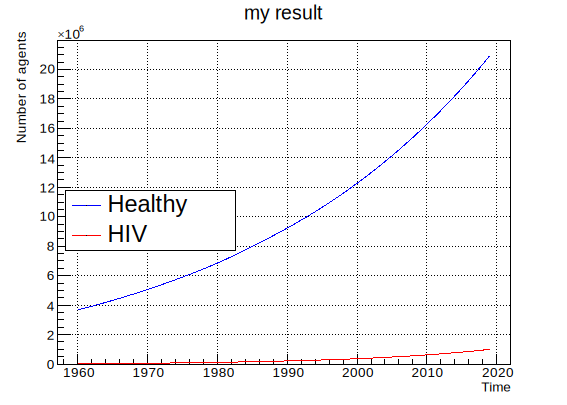

# BioDynMo for HIV modelling in Malawi

## Project description

This repository is the result of joint work of CERN and the University of 
Geneva. With this project, we attempt to accelerate epidemiological modelling 
with CERN's HPC framework [BioDynaMo](https://biodynamo.org) designed to 
simulate billions of agents in the most efficient way possible. BioDynamMo is
hosted on [GitHub](https://github.com/BioDynaMo/biodynamo) and more information 
can be found in the associated 
[publication](https://doi.org/10.1101/2020.06.08.139949).

With the code of the repository, we attempt to simulate the spread of HIV in 
Malawi based on a [publication](https://doi.org/10.1101/2020.12.23.20248757) 
written by Janne Estill et al. The code is fairly general and interested users
should be able to apply the model to other countries by using different 
parameters with ease. As of now, there are still some key features such as the 
disease progression missing but they will be included in the near future.


## The agent-based model (in a nutshell)

In the curren setup, the agents have the following attributes:
* sex (male / female),
* location (categorical),
* age (number),
* health state (categorical),
* as well as biomedical and sociobehavioural riskfactors.

For each time step (year), BioDynaMo executes four behaviors for each agent. \
These are:
* Random migration to other locations
* Female agents in a certain age group can give birth (and possibly infect their 
  child)
* Agents choose partners at their respective location and can possibly infect 
  each other
* Agents get older, their risk factors change, the disease progresses, and under
  certain circumstances the agents also die

At the end of the `README` you may find a brief overview of what you can expect
to find in which files of the repository. 

## Preliminary results

While this project is still in the early development stages, the preliminary 
results look promising speeding up the previous solution dramatically. On the 
current MacBook Pro (M1), a simulation of 60 years (1960-2020) starting with 
3.6 million people and ending with roughly 22 million people took less than a 
minute. Older notebooks may take some more time, for instance, a notebook with a
fairly outdated i7-4500U processor took roughly 3 minutes. 

The result of the simulation is shown in the picture below. It roughly reproduces
the demography of Malawi but there are still severe limitations in place at this
stage.



## Current limitations

The repository is still work in progress. We believe that the code captures the 
foundation of the model which is why we decided to post this repository 
publicly hoping that other BioDynaMo users can possibly benefit from it.
Many modelling details from Estill et al. are still missing, e.g. the mating is
different, there is no disease progression, the death module is different, and 
so on. We hope to add these details in the future.

## Credit 

The repository is also inspired by the `epidemiology` demo of **BioDynaMo** 
simulating an SIR base model. It was created by Lukas Breitwieser.

## Contact

For questions regarding BioDynaMo, contact the BioDynaMo team via 
the official channels: 
[slack](https://cernopenlab.slack.com/messages/biodynamo/) or 
the [forum](https://forum.biodynamo.org). 
For questions regarding the underlying 
model, please consult Janne Estill et al.'s publication or contact
the authors directly.

# Compiling the source code

To compile the code, you'll need to have BioDynaMo installed. 

## BioDynaMo installation

BioDynaMo can be installed in two ways. For our purpose, we need 
features that are not included in `BioDynaMo's v1.0 release`, thus the default 
installer is not recommended here. Instead, we recommend to build it from 
source.
For more details, see [here](https://biodynamo.org/docs/devguide/build/). 
Note that BioDyanMo supports Ubuntu, CentOS, and macOS at the moment.
You may want to check the OS dependent prerequisites for BioDynaMo
[here](https://biodynamo.org/docs/userguide/prerequisites/), especially if
you're using macOS. 
Note that the following will install BioDynaMo in the
current folder, thus don't run it in the `hiv_malawi` folder. Consider choosing
your `home` folder.
To install BioDynaMo, run the following commands:
```bash
git clone https://github.com/BioDynaMo/biodynamo.git
cd biodynamo

# Install the prerequisites
./prerequisites.sh all

# Create the build directory
mkdir build
cd build

# Build BioDynaMo
cmake ..
make -j <number_of_processors_for_build>
``` 
We recommend to add the following command to your `.bashrc/.zshrc`:
```bash
alias thisbdm=". <path_to_biodynamo>/biodynamo/build/bin/thisbdm.sh"
```
Close and reopen your terminal, type `thisbdm` to source BioDynaMo and you're 
good to proceed to the next step.

## Running the `hiv-malawi` simulation

Once BioDynaMo is installed, make sure it is sourced in the terminal window that
you want to use to run the `hiv_malawi` simulation. If it's sourced 
correctly, you should see something like `[bdm-1.1.X]` in your terminal. If 
not, run 
```bash
. <path_to_biodynamo>/biodynamo/build/bin/thisbdm.sh
```
or `thisbdm` if you did set the alias as recommended above.

We're now ready to run the `hiv_malawi`. Therefore, please navigate to this 
repository with your shell, i.e. `cd <some_path>/hiv_malawi`. Then run the 
following commands:
```bash
mkdir build
cd build
cmake ..
make -j <number_of_processors_for_build>
./hiv_malawi
```
or even simpler:
```
bdm run
```
which basically executes the the above steps in the background.

## Run the unit tests

To execute the unit tests, execute
```
bdm test
```
Needless to say, all should pass.

## Debugging guide

Generally, `gdb` and `lldb` are advised on Linux and macOS, respectively. For 
developers using `VS Code`, we recommend the extension `CodeLLDB` by *Vadim 
Chugunov*. We added a configuration file `.vscode/launch.json` to support this 
way of debugging. To try it, please do the following:
1. Install the VS Code extension `CodeLLDB`
2. If it is necessary for you to debug BioDynaMo itself, compile it in the Debug
   mode first. Generally, this is not necessary if you assume the bug appears
   it this repository.
   ```bash
   cd <some_path>/biodynamo/build
   make cleanbuild
   cmake -DCMAKE_BUILD_TYPE=Debug .. && make -j<num_processors>
   . bin/thisbdm.sh
   ```
3. Build this repository in the debug build.
   ```bash
   cd <some_path>/hiv_malawi/build
   rm -rf *
   cmake -DCMAKE_BUILD_TYPE=Debug .. && make -j<num_processors>
   ```
4. Open your debug panel in VS Code (column on the very right) and click the 
   the green arrow "Launch Simulation".
5. Start the simulation by clicking play, use editor to set breakpoints etc.

Note: if you run on macOS, we recommend to add `-DCMAKE_CXX_FLAGS="-glldb"` to 
the `cmake` command.


# Components of /src

The project contains header (.h) and source (.cc) files.
Typically, there's a header and a source file for each file name.
Sometimes, the header contains the entire implementation and we therefore
omit the source file.
In the following, you may find a high level description of what you'll
find in the different file names.

* **datatypes (.h)**

  This header file contains some data types that are used all 
  over the simulation and are therefore of general importance.

* **sim-param (.h)**

  In this header, we specify the simulation parameter of the simulation.
  Especially, it contains the modelling parameters that can be changed 
  to model the different scenarios.

* **main (.h/.cc)**

  This contains the main script, it's basically the starting point of the 
  program.
  At the moment it's very simple, but there are extensions of which one may 
  think of. For that reason it's isolated already.

* **bdm-simulation (.h/.cc)**

  Here, you'll find the core BioDynaMo simulation. It's of great interest to
  understand what's happening here since it shows the basic structure of a 
  BioDynaMo simulation.

* **categorical-environment (.h/.cc)**

  For the case at hand, we had to design a custom environment,
  basically the world in which the agents live in. 
  It stores global information, such that agents know which 
  other agents are at their specific location.

* **person (.h)**

  This header specifies the properties of a single agent.

* **person-behaviour (.h)**

  This header specifies how an agent behaves in its environment, 
  i.e. how it updates it's parameters in every step of the simulation.

* **population-initialization (.h/.cc)**

  When we start a simulation, we want to have a heterogeneous population 
  representing a real country. We need different sexes, with different
  ages at different locations. Here, we define the necessary functions.

* **stdout-utils (.h/.cc)**

  Some print statements that are not of great importance.

* **analyze (.h/.cc)**

  Contains functions for collecting and visualizing the simulation results with ROOT, 
  a famous CERN package integrated in BioDynaMo.
